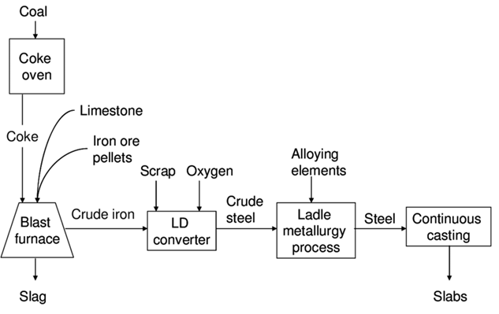

# Case Study– TATA Steel

Tata Steel is a prominent steel manufacturing company in india. Founded as tata iron and steel company in 1907, Tata steel has over 116 years of experience in the steel industry
The firm used to enjoy great profits, and market share. However, recent macro-economic shocks, aging infrastructure, increased competition and reduced demand are threatening the firms dominant position and financials.
The EBITDA margin has been extremely volatile, and the sales figures have greatly plummeted for the year 2023. The firm has hired you as a consultant to analyze the situation and make recommendations to improve financial performance of Tata Steel.

## Steel industry
The steel industry is a critical industry in the world, and demand for its goods are often used as proxy for economic/ infrastructure development in the developing world and as proxy for business expansion in the developed world. Steel is commonly used in buildings (rebar), bridges (girders), tools, ships, trains, cars, bicycles, machines, electrical appliances, etc. 
The world produces over 1885 MT of steel annually. China dominates the market, producing 1018 MT with India second in the race at 154.06 MT.
Manufacturing steel requires the use of raw materials such as iron ore, limestone and coke and is carried out in a blast furnace. Exhibit 1 illustrates the modern manufacturing process.

The manufacturing of steel, although greatly improved in recent decades, still produces a lot of Greenhouse gas emissions. There has been increased scrutiny and intervention in the form of regulations and market focus on ESG metrics.
The industry has been previously flooded with low-cost foreign imports, prompting the government to introduce high tariff barriers and provide production linked incentive schemes ($3.5 billion) for encouraging domestic production.
